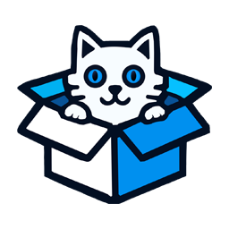

<h1 align="center">
  <br/>
  <a href="https://hits.sh/github.com/silentsoft/schrodingers-inbox/"></a>
  <a href="https://status.schrodingersinbox.net"></a>
  <a href="https://status.schrodingersinbox.net"></a><br/>
  Schrodinger's Inbox
</h1>
<h4 align="center">
  Your emails exist and don't exist until you observe them. A quantum leap in temporary email services.
</h4>

## Features
- 💥 **Temporary Emails**: Get a random email address that self-destructs after 10 minutes.
- 🔐 **Claim Key**: Use a claim key to access your emails anytime, even long after the initial 10 minutes.
- 👻 **Anonymous**: No personal information required.

## Disclaimer
This service does not store any of the emails you receive. Emails are only available temporarily when you observe them. Please do not use this service as your primary email address.

##  Installation
```
$ git clone https://github.com/silentsoft/schrodingers-inbox.git
$ cd schrodingers-inbox
$ mvnw spring-boot:run
```

## Packaging
```
$ mvnw clean package -P production
```

## Contributing
Pull requests are welcome. For major changes, please open an issue first to discuss what you would like to change.

Please note we have a [CODE_OF_CONDUCT](https://github.com/silentsoft/schrodingers-inbox/blob/main/CODE_OF_CONDUCT.md), please follow it in all your interactions with the project.

## License
Please refer to [LICENSE](https://github.com/silentsoft/schrodingers-inbox/blob/main/LICENSE.txt) and [NOTICE](https://github.com/silentsoft/schrodingers-inbox/blob/main/NOTICE.md).
